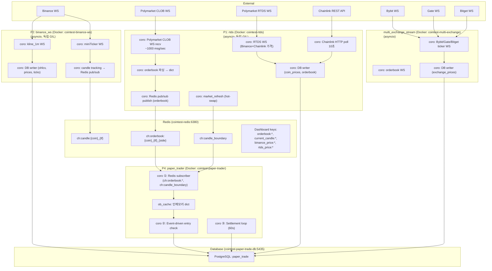
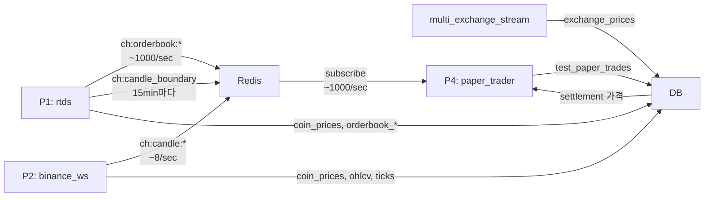

# Architecture: Crypto Candle Paper Trading System

## Current Architecture



---

## 프로세스 분리 근거

### GIL 경합: 1-Process vs Multi-Process

| 작업 | GIL 점유 | 1-Process | Multi-Process |
|------|---------|-----------|---------------|
| JSON parse (orderbook) | ~0.1ms × 1000/sec = **100ms/sec** | 다른 작업에 밀림 | P1에서만. 독립 처리 |
| Entry check | ~0.05ms × N전략 = **~50ms/sec** | OB 파싱에 밀림 | P4에서만. 즉시 처리 |
| **합계** | **~150ms/sec** | **15% 경합** | **각 0%** |

### 비교

| | 1-Process | Multi-Process + Redis |
|---|---|---|
| GIL 경합 | **15%** | **0%** |
| 진입 latency | 0 (dict) | ~0.1-0.5ms (Redis pub/sub) |
| 장애 격리 | 없음 | **완전 (Docker 컨테이너)** |
| 확장성 | 수직만 | **수평** |
| 배포 | 단일 | 개별 롤링 업데이트 |

---

## P1: rtds (Real-Time Data Service)

Polymarket CLOB WS + RTDS WS + Chainlink REST 통합 I/O 전용 서비스.

| 컴포넌트 | 동시성 | 역할 |
|----------|--------|------|
| Polymarket CLOB WS | 코루틴 | ~1000 msg/sec. book + price_change 이벤트 |
| orderbook 파싱 | 코루틴 | 인메모리 dict 업데이트 |
| Redis pub/sub publish | 코루틴 | `ch:orderbook:{coin}_{tf}_{side}` 즉시 publish |
| RTDS WS | 코루틴 | Binance/Chainlink 실시간 가격 (primary) |
| hot-swap | 코루틴 | 15min 캔들 경계 zero-gap WS 교체 + `ch:candle_boundary` publish |
| Chainlink poll | 코루틴 | 10초마다 4코인 HTTP fetch (fallback) |
| DB writer | 코루틴 | coin_prices, orderbook_books/changes 배치 flush (asyncpg, 5초) |

| 데이터 | 출력 | 빈도 |
|--------|------|------|
| orderbook | Redis pub/sub `ch:orderbook:*` | ~1000/sec |
| orderbook | Redis key `orderbook:*` (대시보드) | ~1000/sec |
| candle boundary | Redis pub/sub `ch:candle_boundary` | 15분마다 1회 |
| coin_prices | DB (RTDS binance/chainlink + REST chainlink) | ~8 rows/sec |
| orderbook snapshots | DB (orderbook_books, orderbook_changes) | ~1000/sec |

### Pub/Sub 메시지 형식

**`ch:orderbook:{coin}_{tf}_{side}`**
```json
{
  "coin": "btc", "timeframe": "15m", "side": "up",
  "best_bid": 0.52, "best_ask": 0.54, "mid_price": 0.53,
  "slug": "btc-updown-15m-1763618400",
  "token_id": "12345...",
  "timestamp": 1763618400.123,
  "candle_start_ts": 1763618400,
  "candle_end_ts": 1763619300
}
```

**`ch:candle_boundary`**
```json
{
  "event": "candle_boundary",
  "timeframe": "15m",
  "timestamp": 1763619300
}
```

---

## P2: binance_ws

Binance WebSocket 전용 서비스. miniTicker + kline_1m 수집.

| 컴포넌트 | 동시성 | 역할 |
|----------|--------|------|
| miniTicker WS | 코루틴 | 실시간 가격 → candle tracking → Redis |
| kline_1m WS | 코루틴 | closed 1m candle → DB |
| candle publish | 코루틴 | `ch:candle:{coin}_{tf}` pub/sub + `current_candle:*` key |
| DB writer | 코루틴 | coin_prices (binance), binance_ohlcv_1m, binance_ticks 배치 flush |

| 데이터 | 출력 | 빈도 |
|--------|------|------|
| candle | Redis pub/sub `ch:candle:*` | ~8/sec |
| candle | Redis key `current_candle:*` (대시보드) | ~8/sec |
| binance prices | DB coin_prices | ~4 rows/sec |
| ohlcv | DB binance_ohlcv_1m | 1m마다 4 rows |
| ticks | DB binance_ticks | ~4 rows/sec |

---

## P3: ml_predictor (미구현 — 향후)

> ML 기반 예측은 현재 구현되지 않음. 향후 추가 시:
> - Redis subscribe `ch:candle:*` → feature engineering → XGBoost → Redis publish `ch:prediction:*`
> - CPU 전용 프로세스, 독립 GIL

---

## P4: paper_trader

Redis pub/sub 기반 전략 실행 + 정산. asyncio 단일 스레드 → **lock 불필요**.

| # | 컴포넌트 | 동시성 | 역할 |
|---|----------|--------|------|
| ① | Redis subscriber | 코루틴 | `ch:orderbook:*`, `ch:candle_boundary` 수신 → ob_cache |
| ② | Entry check | event-driven | ob_cache 업데이트 즉시 전략 체크 → DB INSERT |
| ③ | Settlement loop | 코루틴 (60s) | candle_end + 20s 후 정산 |

### 오더북 캐시 (ob_cache)

P4는 P1에서 pub/sub으로 수신한 오더북을 인메모리 dict에 캐싱:
```python
ob_cache: Dict[str, Dict]  # key: "{coin}_{tf}_{side}"
```
- `ch:orderbook:*` 수신 → ob_cache 업데이트 → `_check_entry()` 즉시 호출
- `ch:candle_boundary` 수신 → ob_cache 클리어 (stale slug 방지)
- TTL guard: 30초 이상 된 캐시는 무시

### 전략: BandPairStrategy

5c 간격 밴드에서 UP/DOWN 양쪽 구매. 카운터 모멘텀.

| 항목 | 값 |
|------|-----|
| 밴드 폭 | 5c (0.05) |
| 진입 | best_ask >= band_upper - entry_buffer |
| 밴드 이동 | best_bid >= band_upper + band_move_buffer |
| V2 | 캔들 내 같은 밴드 재진입 방지 |

### Settlement

| Timeframe | 가격 소스 | 판정 |
|-----------|----------|------|
| 1H | `coin_prices.binance_price` | `end_price >= start_price` → UP |
| 15m | `coin_prices.chainlink_price` | `end_price >= start_price` → UP |

- WIN: `pnl = contracts - cost` / LOSE: `pnl = -cost`

### Real Trading (미구현 — 향후)

> 실제 주문 실행은 현재 구현되지 않음. 향후 추가 시:
> - asyncio.create_task로 non-blocking 주문
> - +1c 재시도 (max 3회)
> - real_trades 테이블에 기록

---

## Multi Exchange Stream

별도 Docker 서비스. ccxt.pro WebSocket으로 다중 거래소 수집.

| 컴포넌트 | 역할 |
|----------|------|
| Bybit/Gate/Bitget ticker WS | 실시간 가격 수집 |
| orderbook WS | 실시간 오더북 수집 |
| candle tracker | ticker 가격으로 15m/1h/4h 캔들 빌드 |
| DB writer | exchange_prices 테이블 배치 flush |

| 데이터 | Redis 키 | TTL |
|--------|----------|-----|
| 가격 | `exchange_price:{exchange}:{coin}` | 30s |
| 오더북 | `exchange_orderbook:{exchange}:{coin}` | 30s |
| 캔들 | `current_candle:{exchange}:{coin}_{tf}` | 30s |

P1/P2/P4와 독립. 비교 분석용.

---

## 프로세스 간 통신



| 경로 | 방식 | latency | 빈도 |
|------|------|---------|------|
| P1 → P4 (orderbook) | Redis pub/sub | ~0.1-0.5ms | ~1000/sec |
| P1 → P4 (boundary) | Redis pub/sub | ~0.1-0.5ms | 15분마다 |
| P2 → Redis (candle) | Redis pub/sub | ~0.1-0.5ms | ~8/sec |
| P1 → DB (prices) | asyncpg | ~1ms | ~8/sec |
| P2 → DB (prices) | asyncpg | ~1ms | ~4/sec |
| P4 → DB (settlement) | asyncpg | ~1-5ms | 60초마다 |

---

## 확장 전략

| 병목 | 방법 |
|------|------|
| 코인 수 증가 | P1/P4를 코인 그룹별 분할 |
| 전략 수 증가 | P4를 전략 그룹별 분할 (같은 Redis subscribe) |
| WS 메시지 폭증 | P1에 uvloop 적용 |
| DB 쓰기 병목 | 배치 사이즈 증가 + write-behind |
| ML 추가 | P3 인스턴스 추가 (코인별 분할) |

---

## Database

단일 PostgreSQL 인스턴스 (`paper_trade`).

| 테이블 | 소유 프로세스 | 용도 |
|--------|-------------|------|
| `coin_prices` | P1 (write), P2 (write), P4 (read) | Binance + Chainlink 가격 |
| `binance_ohlcv_1m` | P2 | 1분봉 OHLCV |
| `binance_ticks` | P2 | 1초 단위 가격 |
| `orderbook_books` | P1 | Polymarket 오더북 스냅샷 |
| `orderbook_changes` | P1 | Polymarket 오더북 델타 |
| `test_paper_trades` | P4 | Paper trading 거래 기록 |
| `exchange_prices` | multi_exchange_stream | 다중 거래소 가격 |

## Docker 서비스

| 서비스 | 컨테이너명 | 포트 |
|--------|-----------|------|
| paper_trade_db | cointest-paper-trade-db | 5435 |
| redis | cointest-redis | 6380 |
| rtds | cointest-rtds | - |
| binance_ws | cointest-binance-ws | - |
| paper_trader | cointest-paper-trader | - |
| multi_exchange_stream | cointest-multi-exchange | - |
| dashboard | (별도 실행) | 3839 |
